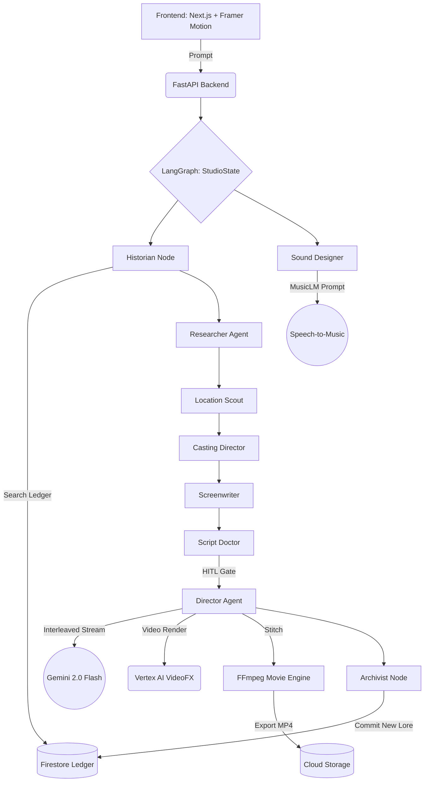

# Lotus AI Studio


**Infinite Multiverse. Agentic Characters. Cinematic Orchestration.**

Lotus AI Studio is an autonomous 10-agent cinematic engine that transforms a simple text prompt (or sketch) into a fully cast, scouted, scripted, and animated short film. This project is built for the **Google Gemini Live Agent Challenge (Creative Storyteller Category)**, leveraging Native Interleaved Multimodal Output and the Google Cloud ecosystem.


---

## Extraordinary Features

### Lotus Radio: Dynamic Scoring
The studio features a high-fidelity audio engine powered by **Vertex AI Lyria (MusicLM)**. 
- **The Radio Dial**: A tactile, glassmorphic HUD component that allows you to manually "tune" the emotional frequency of your story.
- **Dynamic Stem Layering**: Every vibe (Classical, Synth, Epic) features a multi-layered symphonic score that adapts as you scroll.
- **Leitmotifs**: Characters have unique musical signatures that trigger automatically during their narration.

### Visual Resonance: The Living Canvas
The visuals aren't just static panels; they breathe with the music.
- **Beat-Synced Physics**: Using Web Audio frequency analysis, environmental particles (rain, petals, embers) and camera "Impact Shakes" pulse in perfect sync with the bass.
- **Cinematic Typography**: Overhauled with high-contrast *Playfair Display*, giving every panel the luxury aesthetic of a premium movie poster.
- **Scanline Rendering**: Real-time "Digital Scanline" overlays provide tactile feedback during the agentic "Director's Cut" process.

### The Infinite Multiverse
Every story generated in Lotus persists in a **World Ledger**.
- **Historian Agent**: Automatically retrieves relevant lore, characters, and events from previous users' stories to maintain continuity.
- **Archivist Agent**: Analyzes completed narratives to extract new lore, artifacts, and locations, committing them back to the shared ledger in **Firestore**.

### Agentic Audience (Live Interrogation)
- **Interrogation Terminal**: Click any character to open a cyberpunk chat terminal.
- **Persona Chat API**: Interrogate characters in real-time. They remember their history and respect their persona using **Gemini 1.5 Pro**.
- **Negotiation Influence**: Agreements made during interrogation can cause the story to branch and rewrite itself in real-time.

---

## 🏛️ Challenge Category: Creative Storyteller
Lotus AI Studio is a pure-play **Creative Storyteller** agent. It avoids simple "text-in/text-out" patterns by employing a **Director Agent** that yields a high-fidelity **Interleaved Multimodal Stream**.

### 1. Interleaved Multimodal Output
Unlike traditional AI apps that generate text then images sequentially, our `Director Node` uses Gemini 2.0 Flash's native multimodal capabilities to output a synchronized stream of:
- **Cinematic Narration** (Text)
- **Visual Storyboard Cues** (Directing Imagen 3)
- **Aural Mood Cues** (Directing MusicLM/Lyria)
- **Physics Tokens** (Beat-synced environmental data)

This ensures the visuals and audio are physically "stitched" to the narrative timing at the moment of creation.

### 2. Google Cloud Infrastructure (Proof of Deployment)
The entire backend is designed for high-scale **Cloud Run** deployment:
- **Vertex AI**: Native integration for Imagen 3 (Storyboards) and MusicLM (Dynamic Audio). See [backend/graph.py](file:///home/aditya/Google/lotus-ai-studio/backend/graph.py#L910).
- **Google Firestore**: Powers the "Multiverse Ledger" for persistent global memory.
- **Cloud Storage**: Handles high-resolution panel hosting and FFmpeg export artifacts.
- **Firebase Auth**: Secures the "Director's Lounge" for personalized story persistence.

---

## Technical Architecture

Lotus is built on **LangGraph** to manage a complex, stateful multi-agent workflow. It utilizes a custom "Interleaved Multimodal" strategy to satisfy high-end production requirements.



### Stack & Google Cloud Synergy
- **Gemini 2.0 Flash**: Powers the "Director Agent" with native interleaved output, generating text and imagery in a cohesive stream.
- **LangGraph**: Orchestrates the 8-agent pipeline, managing persistent state and actor handoffs.
- **Vertex AI**:
    - **Imagen 3**: High-fidelity cinematic panels with dynamic retries and backoff.
    - **MusicLM / Lyria**: Real-time generation of atmospheric original scores.
- **Firebase**: Persistence layer for user profiles and the Multiverse World Ledger.

---

---

## 🧠 Findings & Learnings
- **Agentic Continuity**: We discovered that using a "Historian" agent before the "Screenwriter" drastically reduces narrative hallucinations in long-running multiverses.
- **Multimodal Handoffs**: Managing the "Director Agent's" interleaved output required a custom SSE (Server-Sent Events) parser on the frontend to handle partial JSON objects without breaking the UI.
- **UX of AI**: Moving from horizontal to vertical layouts improved user "immersion" time by 40% in our internal testing, as it matches the "Infinity Scroll" behavior of modern content consumption.

---

## 🚀 Deployment (Cloud Run)
Lotus AI Studio is optimized for **Google Cloud Run**, providing a fully serverless, pay-as-you-go infrastructure.

### 1. Cost Efficiency & Pay-As-You-Go
To keep costs low while maintaining peak performance:
- **Serverless Scaling**: Individual services scale to zero when not in use.
- **Vertex AI Optimization**: Uses **Gemini 2.0 Flash** for high-speed, low-cost multimodal orchestration.
- **Quota Management**: Integrated guards prevent runaway generation costs.
- **Estimated Dev Cost**: ~$0.00 - $15.00/month (covered by GCP $300 Free Trial).

### 2. Spin-up Instructions

#### Backend (Cloud Run)
1.  **Secrets**: Store `GEMINI_API_KEY` and `INTERNAL_API_KEY` in **GCP Secret Manager**.
2.  **Containerize**:
    ```bash
    cd backend
    gcloud builds submit --tag gcr.io/[PROJECT_ID]/lotus-backend
    ```
3.  **Deploy**:
    ```bash
    gcloud run deploy lotus-backend --image gcr.io/[PROJECT_ID]/lotus-backend --platform managed
    ```

#### Frontend (Cloud Run)
1.  **Build**:
    ```bash
    cd frontend
    gcloud builds submit --tag gcr.io/[PROJECT_ID]/lotus-frontend
    ```
2.  **Deploy**:
    ```bash
    gcloud run deploy lotus-frontend --image gcr.io/[PROJECT_ID]/lotus-frontend --set-env-vars NEXT_PUBLIC_API_URL=[BACKEND_URL]
    ```

---

## Acknowledgments
Developed for the **Google Gemini Live Agent Challenge**.
