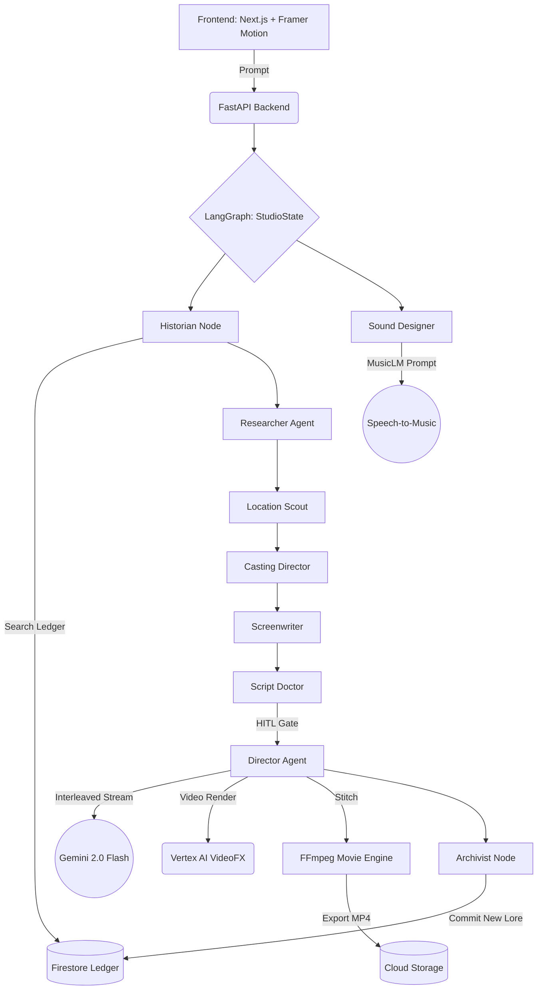

# Lotus AI Studio


**Infinite Multiverse. Agentic Characters. Cinematic Orchestration.**

Lotus AI Studio is an autonomous 10-agent cinematic engine that transforms a simple text prompt (or sketch) into a fully cast, scouted, scripted, and animated short film. Every story contributes to a persistent, shared narrative universe—The Infinite Multiverse.

---

## Extraordinary Features

### Lotus Radio: Dynamic Scoring
The studio features a high-fidelity audio engine powered by **Vertex AI Lyria (MusicLM)**. 
- **The Radio Dial**: A tactile, glassmorphic HUD component that allows you to manually "tune" the emotional frequency of your story.
- **Dynamic Stem Layering**: Every vibe (Classical, Synth, Epic) features a multi-layered symphonic score that adapts as you scroll.
- **Leitmotifs**: Characters have unique musical signatures that trigger automatically during their narration.

### Visual Resonance: The Living Canvas
The visuals aren't just static panels; they breathe with the music.
- **Beat-Synced Physics**: Using Web Audio frequency analysis, environmental particles (rain, petals, embers) and camera "Impact Shakes" pulse in perfect sync with the bass.
- **Cinematic Typography**: Overhauled with high-contrast *Playfair Display*, giving every panel the luxury aesthetic of a premium movie poster.
- **Scanline Rendering**: Real-time "Digital Scanline" overlays provide tactile feedback during the agentic "Director's Cut" process.

### The Infinite Multiverse
Every story generated in Lotus persists in a **World Ledger**.
- **Historian Agent**: Automatically retrieves relevant lore, characters, and events from previous users' stories to maintain continuity.
- **Archivist Agent**: Analyzes completed narratives to extract new lore, artifacts, and locations, committing them back to the shared ledger in **Firestore**.

### Agentic Audience (Live Interrogation)
- **Interrogation Terminal**: Click any character to open a cyberpunk chat terminal.
- **Persona Chat API**: Interrogate characters in real-time. They remember their history and respect their persona using **Gemini 1.5 Pro**.
- **Negotiation Influence**: Agreements made during interrogation can cause the story to branch and rewrite itself in real-time.

---

## Technical Architecture

Lotus is built on **LangGraph** to manage a complex, stateful multi-agent workflow. It utilizes a custom "Interleaved Multimodal" strategy to satisfy high-end production requirements.



### Stack & Google Cloud Synergy
- **Gemini 2.0 Flash**: Powers the "Director Agent" with native interleaved output, generating text and imagery in a cohesive stream.
- **LangGraph**: Orchestrates the 8-agent pipeline, managing persistent state and actor handoffs.
- **Vertex AI**:
    - **Imagen 3**: High-fidelity cinematic panels with dynamic retries and backoff.
    - **MusicLM / Lyria**: Real-time generation of atmospheric original scores.
- **Firebase**: Persistence layer for user profiles and the Multiverse World Ledger.

---

## Quick Start

### 1. Prerequisites
- Python 3.11+
- Node.js 18+
- GCP Project with Vertex AI and Firestore enabled.

### 2. Backend Setup
```bash
cd backend
python -m venv venv && source venv/bin/activate
pip install -r requirements.txt
# Configure GEMINI_API_KEY, GOOGLE_CLOUD_PROJECT in .env
uvicorn main:app --reload
```

### 3. Frontend Setup
```bash
cd frontend
npm install
npm run dev
```

Visit `http://localhost:3000` to start directing.

---

## Acknowledgments
Developed for the **Google Gemini Live Agent Challenge**. Inspired by the vision of persistent, interactive narrative worlds.
