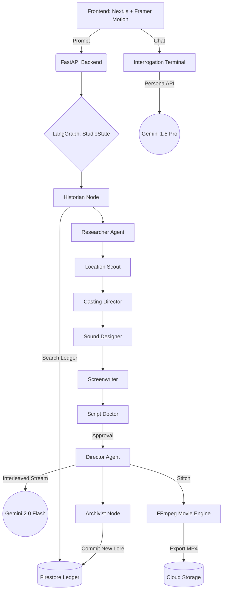

# Lotus AI Studio

**Infinite Multiverse. Agentic Characters. Cinematic Orchestration.**

Lotus AI Studio is an autonomous 10-agent cinematic engine that transforms a simple text prompt (or sketch) into a fully cast, scouted, scripted, and animated short film. Every story contributes to a persistent, shared narrative universe—The Infinite Multiverse.

---

## Extraordinary Features

### The Infinite Multiverse
Every story generated in Lotus persists in a **World Ledger**. 
- **Historian Agent**: Automatically retrieves relevant lore, characters, and events from previous users' stories to maintain continuity.
- **Archivist Agent**: Analyzes completed narratives to extract new lore, artifacts, and locations, committing them back to the shared ledger.

### Agentic Audience (Live Interrogation)
The final output is not just a static story—it's an interactive experience.
- **Interrogation Terminal**: Click on any character to open a cyberpunk-themed chat terminal.
- **Persona Chat API**: Interrogate AI characters in real-time. They remember their history and respect their persona.
- **Negotiation Influence**: Agreements made during interrogation (e.g., bribing a guard) can be committed to the state, causing the story to branch and rewrite itself based on your actions.

### Cinematic Pipeline (8D Audio & Motion)
- **Dynamic SFX & Foley**: The Sound Designer extracts physical actions from the script (e.g., "glass shattering") and layers precise SFX into the final cut.
- **8D Audio Processing**: Immersive spatial audio for narration and ambient scores.
- **Motion Comics**: Image-to-Video generation using Ken Burns effects and Dolby Zooms (zoompan) to turn static panels into an animatic film.
- **Cinematic MP4 Export**: Stitch your masterpiece into a downloadable film instantly.

---

## Technical Architecture

Lotus is built on **LangGraph** to manage a complex, stateful multi-agent workflow.



## Stack & Google Cloud Synergy

- **Gemini 2.0 Native Interleaved Output**: The `DirectorAgent` leverages interleaved streaming to generate narration and imagery in a single pass.
- **Google Agent Development Kit (ADK)**: Powering the `Researcher Agent` for autonomous world-building.
- **LangGraph**: Orchestrates the persistent state and actor-to-actor communication.
- **GCP Infrastructure**:
  - **Cloud Run**: High-concurrency backend hosting.
  - **Firebase Auth & Firestore**: User profiles and the Multiverse World Ledger.
  - **Cloud Multi-media**: Cloud TTS (Narration), Imagen 3 (Visuals), and Vertex AI.

---

## Quick Start

### 1. Prerequisites
- Python 3.11+
- Node.js 18+
- GCP Project with Gemini/Vertex AI enabled.

### 2. Backend Setup
```bash
cd backend
python -m venv venv && source venv/bin/activate
pip install -r requirements.txt
# Set GEMINI_API_KEY, GOOGLE_CLOUD_PROJECT in .env
uvicorn main:app --reload
```

### 3. Frontend Setup
```bash
cd frontend
npm install
npm run dev
```

Visit `http://localhost:3000` to start directing.

---

## Acknowledgments
Developed for the **Google Gemini Live Agent Challenge**. Inspired by the vision of persistent, interactive narrative worlds.
